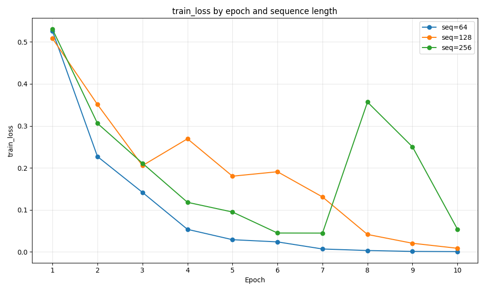
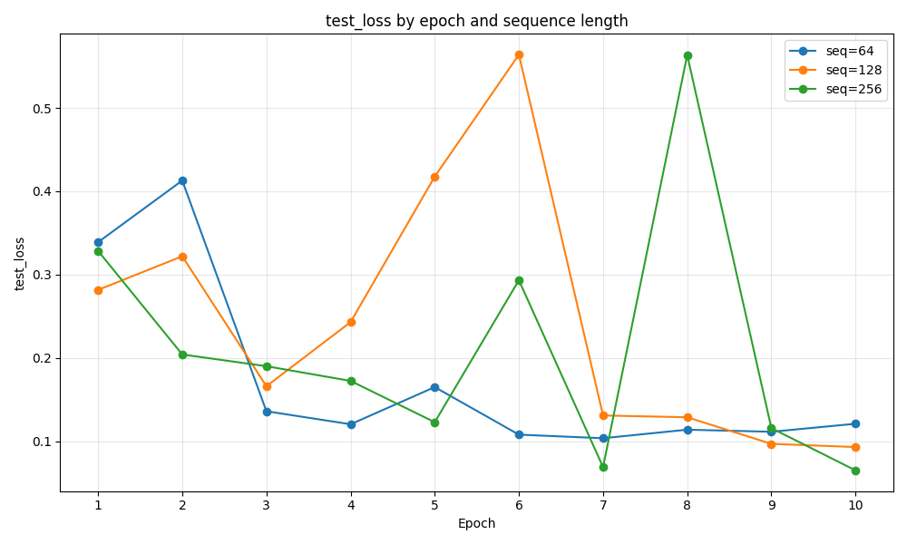
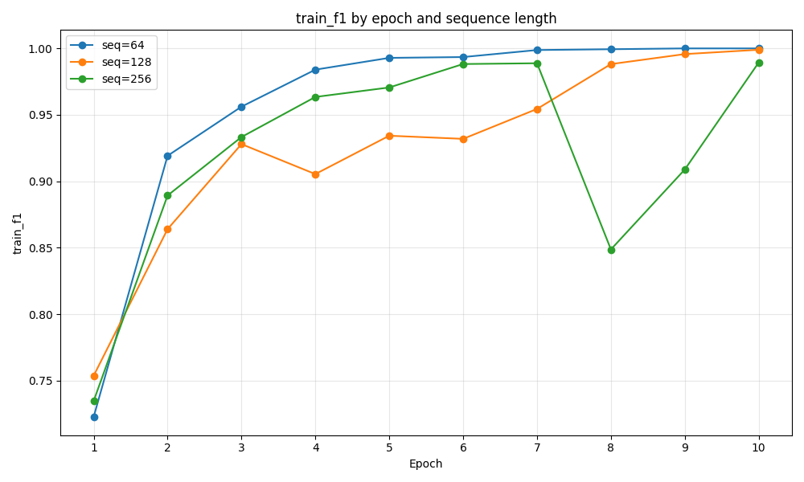
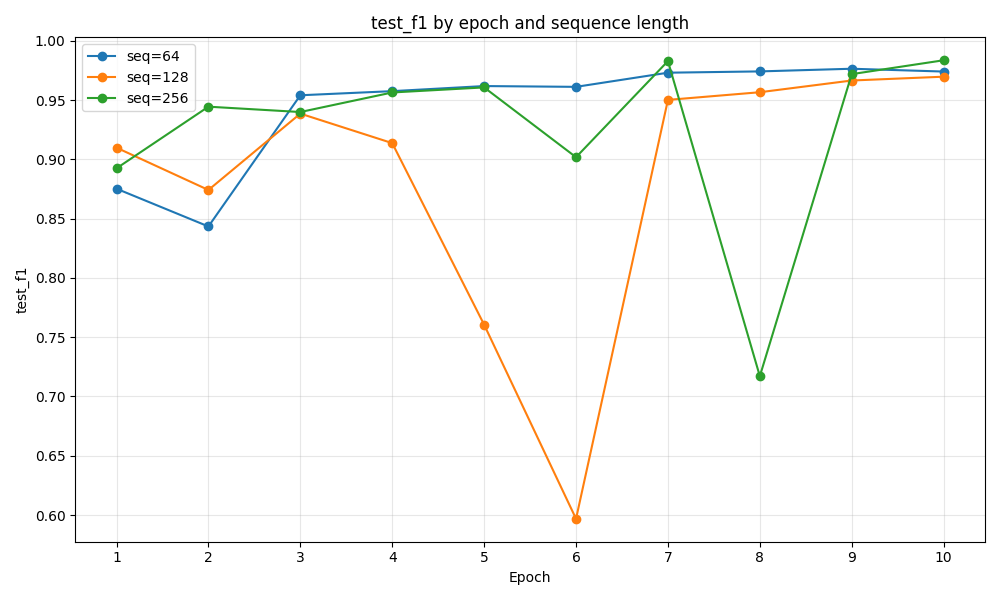
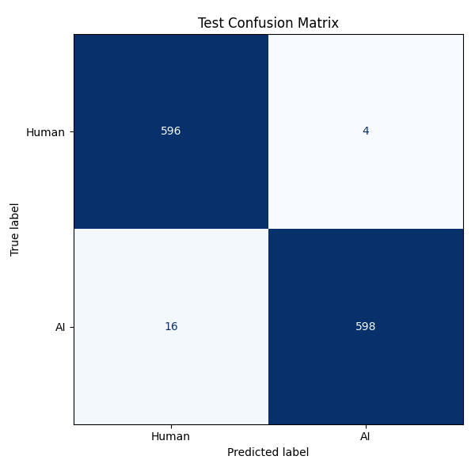

# LSTM Study Report

Author: Rajeev Atla

## Overview

### Objective

The goal of this study is to train and evaluate an LSTM-based text classifier that distinguishes AI-written text from human-written text. The experiments focus on how test performance changes as training progresses across epochs and as the maximum input sequence length changes.

### Dataset

- Source: `data/data.csv`
- Input column: `Text`
- Label column: `Author`
- Classes: `Human`, `AI`
- Split: 80% train / 20% test
- Total rows: 6,069
- Train rows: 4,855
- Test rows: 1,214
- Class balance: near-balanced (`AI=3069`, `Human=3000`)

### Model

The model is a PyTorch Lightning binary classifier built around a learned embedding layer, a single-layer LSTM encoder, dropout, and a linear output head that produces one logit. Training uses `BCEWithLogitsLoss`, and the best checkpoint is selected by the highest test F1 score.

## Experimental Setup

### Environment

- Python environment: `uv`
- Framework: PyTorch Lightning
- Hardware: NVIDIA GeForce RTX 4050 Laptop GPU
- CUDA runtime: 12.8
- Torch build: `2.10.0+cu128`

### Fixed Hyperparameters

- Batch size: `32`
- Learning rate: `0.001`
- Max vocab size: `20,000`
- Embedding dimension: `128`
- Hidden dimension: `128`
- Number of LSTM layers: `1`
- Dropout: `0.2`
- Random seed: `42`
- Lowercasing: enabled
- Optimizer: `Adam`
- Loss: `BCEWithLogitsLoss`

### Hyperparameters Studied

- Epochs: `1` through `10`
- Sequence lengths: `64`, `128`, `256`

## Methodology

### Preprocessing

Text is normalized by collapsing repeated whitespace and lowercasing. Tokenization uses a simple whitespace-based tokenizer. The vocabulary is built from the training split only, capped at `20,000` tokens, with reserved `<pad>` and `<unk>` tokens. Sequences are truncated to the configured maximum sequence length and padded per batch.

### Training Procedure

Each sequence length is trained as a separate run for up to 10 epochs on the same stratified 80/20 split. PyTorch Lightning logs per-epoch train and test metrics. The best checkpoint for each run is selected using the highest test F1 score. After the study finishes, the best checkpoint overall is used to generate the final confusion matrix on the test split.

### Metrics

- Train loss
- Test loss
- Train F1
- Test F1
- Accuracy
- Precision
- Recall

## Results

### Study Summary

The study completed all three planned sequence-length runs (`64`, `128`, and `256`) for 10 epochs each. The best overall configuration was sequence length `256`, which reached the highest test F1 at epoch `10`.

Final best run:

- Sequence length `256`
- Best epoch `10`
- Test loss `0.0651`
- Test accuracy `0.9835`
- Test precision `0.9934`
- Test recall `0.9739`
- Test F1 `0.9836`

### Best Configuration

- Sequence length: `256`
- Best epoch: `10`
- Test loss: `0.0651`
- Test accuracy: `0.9835`
- Test precision: `0.9934`
- Test recall: `0.9739`
- Test F1: `0.9836`

### Plots

#### Train Loss



Notes: Train loss decreases strongly for all three sequence lengths, but the `256` run shows noticeable instability in the middle of training before recovering late. The `64` run is the smoothest and most monotonic, while `128` and `256` both have sharper swings.

#### Test Loss



Notes: Test loss favors longer sequences overall, with the best final result coming from sequence length `256`. The `128` and `256` runs both show temporary regressions, indicating optimization instability despite strong eventual performance.

#### Train F1



Notes: All runs achieve very high train F1 by the end of training. Sequence lengths `64` and `128` approach or effectively reach perfect training performance, while `256` also finishes near-perfect despite volatility in the middle epochs.

#### Test F1



Notes: Test F1 improves substantially during training for all runs. Final best test F1 values were `0.9764` for `64`, `0.9697` for `128`, and `0.9836` for `256`, making `256` the strongest overall configuration.

### Confusion Matrix



Interpretation: The final confusion matrix for the best `256`-token checkpoint is:

- True Human predicted Human: `596`
- True Human predicted AI: `4`
- True AI predicted Human: `16`
- True AI predicted AI: `598`

This indicates very strong performance on both classes, with only 20 total mistakes on the 1,214-example test set. The model is slightly more likely to miss AI examples as Human than to misclassify Human examples as AI.

### Completed Run Snapshots

#### Sequence Length 64

- Best epoch: `9`
- Test loss: `0.1114`
- Test accuracy: `0.9761`
- Test precision: `0.9756`
- Test recall: `0.9772`
- Test F1: `0.9764`

#### Sequence Length 128

- Best epoch: `10`
- Test loss: `0.0931`
- Test accuracy: `0.9695`
- Test precision: `0.9753`
- Test recall: `0.9642`
- Test F1: `0.9697`

#### Sequence Length 256

- Best epoch: `10`
- Test loss: `0.0651`
- Test accuracy: `0.9835`
- Test precision: `0.9934`
- Test recall: `0.9739`
- Test F1: `0.9836`

## Analysis

### Performance Trends

All three sequence lengths eventually reached strong test performance, but the learning dynamics were different. The `64`-token run was comparatively stable and peaked at epoch `9`. The `128`-token run showed a pronounced mid-training collapse in test F1 at epochs `5` and `6` before recovering to a strong final result. The `256`-token run showed the strongest final performance overall, but it also exhibited the largest instability, including a major regression at epoch `8` before recovering and setting the best result at epoch `10`.

### Error Analysis

The final confusion matrix shows only 4 Human texts misclassified as AI and 16 AI texts misclassified as Human. The model is therefore slightly more conservative about predicting AI, which is consistent with its higher precision (`0.9934`) than recall (`0.9739`) on the positive class. A useful next step would be to inspect those 20 test errors directly to identify stylistic overlap between the two classes.

### Generalization

The completed runs still suggest some overfitting at later epochs because train F1 approaches `1.0` while test F1 remains lower. Even so, the generalization gap is relatively small in the best run: train F1 `0.9894` versus test F1 `0.9836` for sequence length `256` at epoch `10`. The more important issue appears to be optimization instability rather than simple monotonic overfitting.

## Limitations

- Dataset limitations: the report currently reflects a single 80/20 split rather than cross-validation
- Tokenization limitations: whitespace tokenization ignores subword structure and punctuation nuance
- Model limitations: a single-layer LSTM is a relatively simple encoder for long-form text classification
- Evaluation limitations: the study varies only sequence length and training epoch, while other hyperparameters remain fixed

## Conclusion

The completed study shows that the Lightning-based LSTM performs strongly on this dataset and that longer sequence context helps. Among the tested configurations, sequence length `256` delivered the best overall result with test F1 `0.9836` and test accuracy `0.9835` at epoch `10`. Despite some instability during training, the final model generalized well and made only 20 mistakes on the held-out test set.

## Next Steps

- Expand the hyperparameter search.
- Try stronger text encoders or pretrained embeddings.
- Add validation splits or cross-validation.
- Improve text preprocessing and error analysis.

## Appendix

### Reproduction

Clone the repository (located at https://github.com/RajeevAtla/ai-detection)

```powershell
uv run python scripts/train_lstm.py
```

### Artifact Locations

- Study summary: `artifacts/study/study_summary.json`
- Study metrics: `artifacts/study/study_metrics.csv`
- Per-run outputs: `artifacts/study/seq_len_*`
- Per-run summaries:
  - `artifacts/study/seq_len_64/metrics.json`
  - `artifacts/study/seq_len_128/metrics.json`
  - `artifacts/study/seq_len_256/metrics.json`
